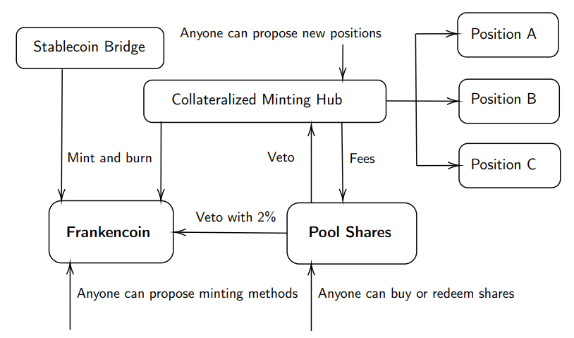

# 🧀 Overview

## Structure and Purpose

The purpose of this page is to provide potential users of the Frankencoin system with everything they need to know to meaningfully intereact with it. For a deeper analysis of its economic properties, we refer to [the research publication](https://frankencoin.com/thesis-frankencoin.pdf) and for actually interacting with the system, there is a standard [frontend](https://frankencoin.com). The name Frankencoin hints at its self-governing nature, but also the risks associated with releasing an artificial machinery into the wild. If you encounter errors or if things are not clear to you, you can [reach out to us in the Telegram group](https://web.telegram.org/a/#-1001924255643) or [file a suggestion for improving this page on github](https://github.com/Frankencoin-ZCHF/frankencoin-dapp/issues).

## Frankencoin (ZCHF) and Frankencoin Pool Shares (FPS)

The Frankencoin system comes with two ERC-20 tokens, a stablecoin called [Frankencoin (ZCHF)](https://etherscan.io/address/0xB58E61C3098d85632Df34EecfB899A1Ed80921cB) and a governance token called [Frankencoin Pool Shares (FPS)](https://etherscan.io/address/0x1bA26788dfDe592fec8bcB0Eaff472a42BE341B2). Unlike other collateralized stablecoins, Frankencoin does not depend on external oracles, making it less susceptible to certain attacks and also more versatile with regards to the used collateral. The disadvantage of that approach is its speed, performing liquidations over the course of days whereas oracle-based systems might react within minutes.

The Frankencoin is a collateralized stablecoin that tracks the value of the Swiss franc. There is no hard peg to the Swiss franc, but a set of economic constraints that incentivizes the market to softly push it towards parity from two sides. Most importantly, the system is [over-collateralized](positions/): for each Frankencoin in circulation, there must other tokens worth at least one Frankencoin backing it. Furthermore, FPS holders have a number of ways to influence the long term price of the Frankencoin by making it more or less expensive to mint Frankencoins, similarly to how a central bank keeps the exchange rate of its own currency in balance. The underlying assumption here is that the FPS holders recognize that the system (and therefore also their tokens) is the most valuable when the Frankencoin tracks the Swiss franc as reliably a possible, and that they use their power to govern the system accordingly.

Frankencoin Pool Shares are the [governance](governance.md) token of the system. Anyone can obtain newly minted FPS by providing equity capital to the system (or later return them again to get their share of capital back). The FPS holders benefit from the earned fees and liquidation profits, but they are also the ones that carry the residual risk of liquidations, similar to the shareholders of a bank. Therefore, FPS holders have an incentive to grow the system and ensure its stability. The governance process is veto-based: anyone can propose new types of collateral or even completely new methods to bring Frankencoin into circulation, but already 2% of the voting power suffices to veto such proposals.

## Use Cases

Like other stablecoins, the Frankencoin primarily serves three use-cases. The only use-case described extensively in this documentation is that of borrowing as it is embedded in the system. To fully leverage the other use-cases, further tools and services such as exchanges and wallets are necessary that are not described herein.

### Payments

The Frankencoin (ZCHF) can be used to make payments in Swiss francs. Please consult the [landing page](https://frankencoin.com) for a list of apps and services that help in using the Frankencoin as a means of payment, as well as a list of bridged Frankencoin token on other networks than Ethereum mainnet. Payments typically concern small amounts and therefore a layer two instance of the token might be preferred over the mainnet instance.

### Store of Wealth

The Swiss franc has an excellent track record of stability relative to other fiat currencies. Over the past fifty years it has lost XX% of its value, whereas the dollar and the euro have lost more than YY%. It is often considered a safe haven when the world is in turmoil. So far, crypto investors could not get significant Swiss franc exposure without going off-chain. For this use-case, it is important to be able to trade the ZCHF in high volumes at narrow spreads.

### Borrowing / Seignorage

Anyone can mint new Frankencoins against a collateral using the built-in borrowing mechanism. All borrowing is based on what we refer to as _positions_. In Liquity, these are called _troves_ and in the Maker system _vaults_. They all refer to the account of a user within the system that holds a positive balance of a collateral asset and a negative balane of Frankencoins that must be repaid in order to get the collateral back. The Frankencoin system charges a non-refundable interest rate up front when minting new Frankencoins. Some of the minted Frankencoins are also held back as a reserve in case the position has to be liquidated.

## Technical Architecture

The Frankencoin system consists of a set of smart contracts on Ethereum mainnet. The two token contracts serves as a foundation for everything else. The ZCHF can have an arbitrary number of contracts that have the power to mint and burn ZCHF. Anyone can propose new such contracts and once they passed the governance process, they can start minting and buringn ZCHF. Today, there are two such contracts. One is a simple bridge to bootstrap the Frankencoin based on the existing CryptoFranc (XCHF). The other is a contract named minting hub that serves as the central point to manage all debt positions. The FPS token has built-in governance features and holds the equity capital of the system.

<figure><figcaption>
Components of the Frankencoin System
</figcaption></figure>
