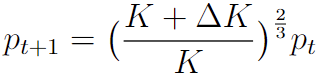

# Pool Shares

## Reserve Pool Shares

Frankencoin Pool Shares (FPS) are shares in the equity reserve pool of the Frankencoin system. Being an FPS holdes is similar to being a shareholder of a bank. As the Frankencoin system makes profits through fees or liquidations, the price of the pool shares is automatically adjusted upwards. Likewise, when risks materialize and the reserve pool incurs a loss, the value declines. They can be minted at any time and redeemed again after a mimimum holding period of three months. Over time, reserve pools shares that are not moved accumulate votes. Shareholders with at least 2% of the votes gain veto power.

## Economics

Anyone can create additional pool shares by depositing reserve capital at any time, or redeem them again after a minimum holding period of 90 days. Therefore, an important design consideration is the pricing mechanism for pool shares. As having a price implies having a valuation, this boils down to evaluating the Frankencoin system.

### Proportional Capital Valuation

In an approach inspired by the research paper "[The Continuous Capital Corporation](https://papers.ssrn.com/sol3/papers.cfm?abstract\_id=4189472)", the Frankencoin system evaluates itself at a constant multiple of its capital. This multiple is set to three. So if there is 1 million ZCHF in equity capital K, anyone can subscribe to new pool shares at a valuation of 3 million ZCHF, or also redeem old shares at that valuation. Mathematically, valuation V is:

<figure><figcaption>
Market cap as a function of capital
</figcaption></figure>

Whereas V(K) is the market cap of all Frankencoin Pool Shares (FPS) in circulation if there are K Frankencoins in equity capital. Given the number of pool shares s in circulation, the marginal price p per share is given as

<figure><figcaption>
Price per share
</figcaption></figure>

From the above constraints follow that an investment of additional capital ΔK leads to the following rules for determining the new number of shares given the old number of shares:

<figure><figcaption>
New number of shares after investment ΔK
</figcaption></figure>

Similarly, the same investment ΔK leads to a new price:

<figure><figcaption>
New price per share after investment ΔK
</figcaption></figure>

One can verify that the valuation equation still holds after that investment by multiplying the number of shares with their price in order to obtain the new valuation:

<figure><figcaption>
Verification
</figcaption></figure>

In other words: when someone invests into the Frankencoin system, two thirds of the increased market cap comes from the price increase and one third from the increased number of shares.

### Equilibrium

Consider again the example with 30 million ZCHF in outstanding mints and an interest of 5%, leading to a reserve inflow of 1.5 million per year. Under these circumstances, rational market participants will value the entire pool at 30 million ZCHF and therefore buy additional pool shares until the valuation hits 30 million ZCHF. This valuation is reached at a reserve pool size of 10 million ZCHF, leaving 20 million ZCHF in circulation that can be used for other purposes.

This is essentially fractional reserve banking with a reserve of one third. In contrast, the tier 1 equity capital of modern banks is usually much less than that, so the Frankencoin system has a considerably higher reserves. However, unlike in the traditional banking system, this reserve requirement is not strictly enforced by a regulator, but more like a carrot that attracts the equilibrium towards the reserve target.

If the effective interest at which new positions can be opened is at 5% and the reserve is below the target of one third of the outstanding balance, then it is possible to do interest arbitrage by minting additional ZCHF at an interest of 5% per year and using those to buy pool shares that yield maybe 6% per year. The opposite is the case if the reserve is higher than one third. In that case, minters should think about selling pool shares to repay their debt (if they are able to).

This leads to the following rule of thumb: if the FPS market cap is higher than the market cap of ZCHF, then that means that the market participants are beeting on the system to grow. If the FPS market cap is lower than the ZCHF market cap, then the market is signaling that it expects the Frankencoin system to shrink.

### Limits to Capital Efficiency

What if someone creates a clone of the Frankencoin system with a reserve target of 25%? Would they be able to offer a better deal thanks to a better capital efficiency? Here, one needs to be aware that there is a trade-off. It is certainly more attractive for those who mint some ZCHF to buy pool shares and dump the rest of the coins onto the market. However, one needs to be aware that this implies that there is a buyer for the other 75% of the ZCHF to keep the system in equilibrium. These buyers are typically users that hold ZCHF for transactional purposes. And to them, stability is key. But stability suffers if one aims for an overly ambitious level of capital efficiency, making the clone less attractive for transactional purposes. It is hard to tell where exactly the right equilibrium is, but this is not a race to the bottom where the system with the lowest capital requirements automatically wins. We believe that aiming for a 33% reserve is a robust middle ground, that still allows for plenty of seignorage gains.
